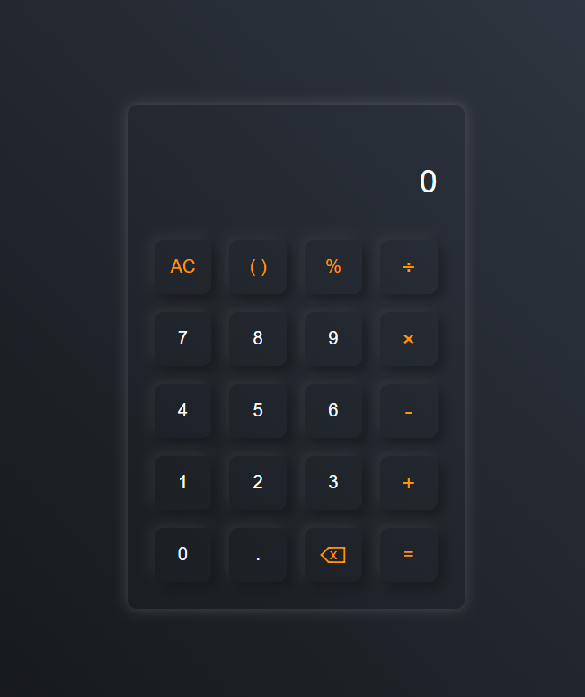

# Calculadora em HTML, CSS e JavaScript

## Descrição
Este projeto é uma calculadora funcional desenvolvida utilizando HTML, CSS e JavaScript. O foco é demonstrar a implementação de uma aplicação interativa baseada em códigos front-end responsivos e intuitivos.

A calculadora suporta operações matemáticas básicas, como adição, subtração, multiplicação, divisão, porcentagem e uso de parênteses para priorização de operações.

## Funcionalidades
- Operações básicas: soma, subtração, multiplicação e divisão.
- Suporte a porcentagem.
- Priorização de cálculos usando parênteses.
- Limpeza rápida de entradas com o botão "AC".
- Corrigir última entrada com o botão "Backspace".
- Atualização dinâmica de resultados enquanto os dados são inseridos.

## Tecnologias Utilizadas
- **HTML**: Estrutura da interface da calculadora.
- **CSS**: Estilização responsiva e design moderno.
- **JavaScript**: Lógica de operações matemáticas e interatividade.

## Estrutura dos Arquivos

- `index.html`: Arquivo principal contendo a estrutura da interface.
- `style.css`: Arquivo de estilização, responsável pelo design visual da calculadora.
- `script.js`: Contém toda a lógica da aplicação, incluindo as operações matemáticas e o gerenciamento de eventos.

## Instalação
1. Faça o download ou clone este repositório:
   ```bash
   git clone https://github.com/Rapouse/Calculator.git
   ```
2. Navegue até o diretório do projeto:
   ```bash
   cd calculator
   ```
3. Abra o arquivo `index.html` no navegador de sua escolha.

## Como Usar
1. Digite os valores e operações diretamente no display da calculadora.
2. Use os botões para realizar as operações desejadas:
   - `AC`: Limpa todo o conteúdo do display.
   - `=`: Calcula e exibe o resultado.
   - `Backspace`: Remove o último caractere inserido.
   - `()`: Insere ou fecha parênteses para priorizar operações.

## Interface da Calculadora


## Veja ao Vivo
[Acesse a Calculadora Online](https://rapouse.github.io/Calculator/)

## Contribuição
Contribuições são bem-vindas! Caso deseje melhorar este projeto, siga os passos abaixo:
1. Fork o repositório.
2. Crie uma branch para suas modificações:
   ```bash
   git checkout -b minha-branch
   ```
3. Commit suas alterações:
   ```bash
   git commit -m "Minha contribuição"
   ```
4. Envie suas alterações:
   ```bash
   git push origin minha-branch
   ```
5. Abra um Pull Request no GitHub.

## Licença
Este projeto está licenciado sob a [MIT License](LICENSE).

## Autor
**Rapouse**  
[GitHub](https://github.com/Rapouse) | [LinkedIn](https://www.linkedin.com/in/james-lima/) | [ko-fi](https://ko-fi.com/rapouse)
